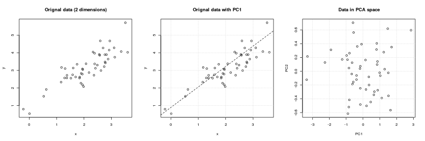
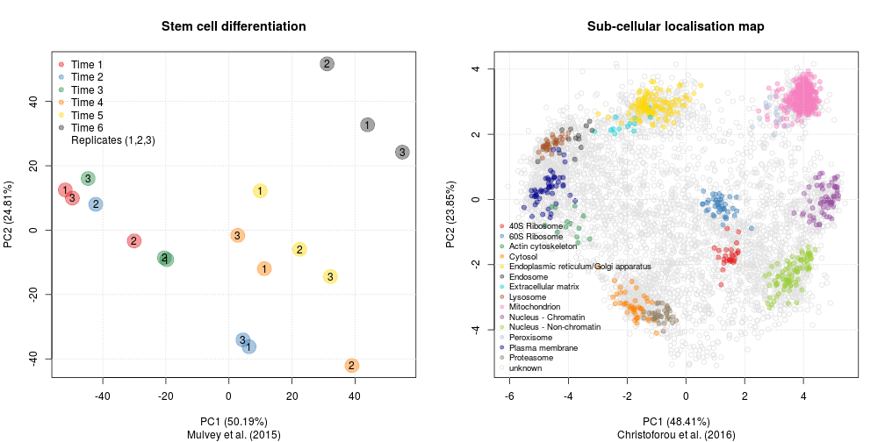
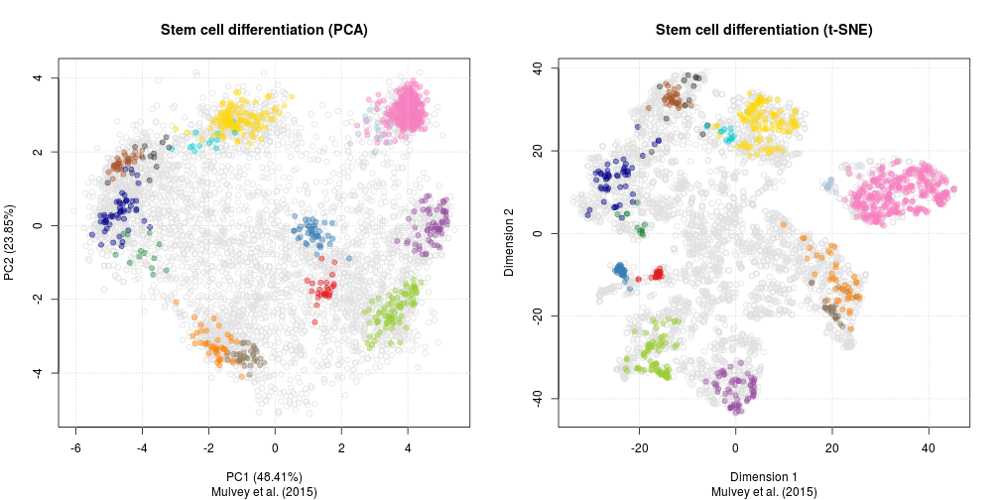

## Visualisation of high-dimensional data 

```
Laurent Gatto
```


## Proteomics examples

Sample-level visualisations from
[Mulvey *et al.* (2015)](https://www.ncbi.nlm.nih.gov/pubmed/26059426)
*Dynamic Proteomic Profiling of Extra-Embryonic Endoderm
Differentiation in Mouse Embryonic Stem Cells.*

Protein-level visualisations from
[Christoforou *et al.* (2016)](https://www.ncbi.nlm.nih.gov/pubmed/26754106)
*A draft map of the mouse pluripotent stem cell spatial proteome.*

## Hierarchical clustering

Hierarchincal clustering start by calculating all pairwise distances
between all features (or samples) and then clusters/groups these based
on these similarities. There are various distances measures and
clustering algorithms that can be used. 


## Principal Component Analysis

Principal Component Analysis (PCA) is a technique that transforms the
original n-dimentional data into a new n-dimentional space. Along
these new dimensions, called principal components, the data expresses
most of its variability along the first PC, then second, .... These
new dimensions are *linear combinations* of the orignal data.

Figures produces with `plot2D` function from the
[`pRoloc` package](https://bioconductor.org/packages/devel/bioc/html/pRoloc.html)

## {.fullpage}



## { .fullpage }




## t-Distributed Stochastic Neighbour Embedding

t-Distributed Stochastic Neighbour Embedding (t-SNE) is a *non-linear*
dimensionality reduction techique, i.e. that different regions of the
data space will be subjected to different transformations. In t-SNE
will compress small distances, thus bringing close neighbours
together, and will ignore large distances.

Figures produces with `plot2D` function from the
[`pRoloc` package](https://bioconductor.org/packages/devel/bioc/html/pRoloc.html)


## Parameter tuning

**Beware** of the `perplexity` and `steps` parameters, that should be
tuned before applying t-SNE.


## { .fullpage }



## References

### t-SNE
- https://lvdmaaten.github.io/tsne/
- http://distill.pub/2016/misread-tsne/
